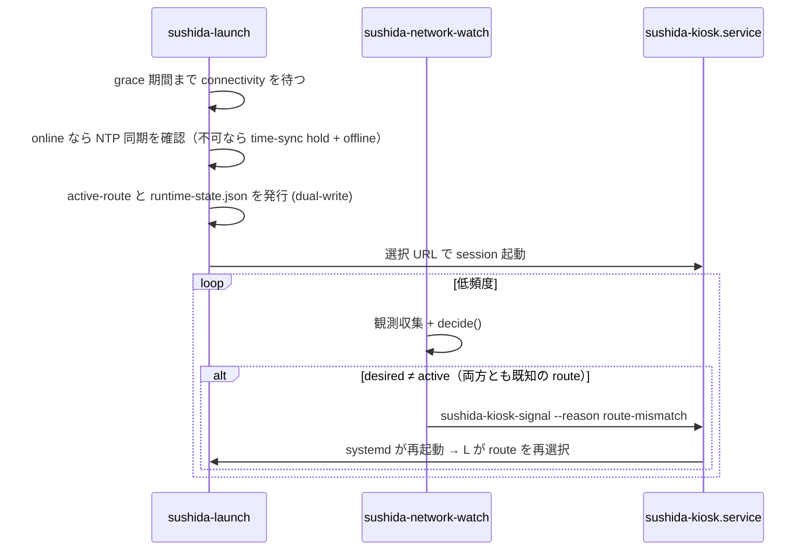

# Runtime routes: 判定モデルと再起動シグナル

- 作成: 2026-07-21（Stage F-06）
- 判定の正本: `sushida_os/runtime/routes.py`（`decide()` と ROUTE_MATRIX テスト）
- route 名の正本: `contracts/runtime-contract.json` の `routes`（checker が
  launcher・watcher・model の3者一致を検査）
- シグナルの正本: `/usr/local/libexec/sushida-kiosk-signal`（shell）と
  `sushida_os/runtime/kiosk_signal.py`（in-process 双子）

## Route と選択順序

route は `online / setup / offline` の3つ。判定は純関数 `decide()` に集約され、
観測（QEMU force-offline marker、time-sync hold、NetworkManager の
STATE/CONNECTIVITY、setup service の active）は呼び出し側が収集する。

優先順位（上から先勝ち。未知・欠損入力は offline へ fail closed）:

1. QEMU force-offline marker → `offline`
2. time-sync hold（時計が未同期のまま）→ `offline`
3. NetworkManager が connected/full → `online`
4. Wi-Fi setup service が active → `setup`
5. それ以外 → `offline`

各 route の表示先: `online` は設定 URL、`setup` は loopback 設定ページ、
`offline` は同梱のローカルページ（URL 値は contract / launcher が正本）。

## 時系列

## 再起動シグナルの安全条件

シグナル送出は必ず検証連鎖を通る: service が active・MainPID が数値かつ >1・
`/proc` に実在・所有 UID が一致・cgroup に正確な service 名。呼び出し側は
PID・signal・service 名を選べず、渡せるのは固定 reason トークン
（`route-mismatch` / `blocked-navigation`）のみ。検証失敗は signal なしの
拒否で、ログにも固定 enum しか出ない。

- network watcher: 外部 helper を呼ぶ（bats が PATH shim で検証）
- navigation watcher: 同一連鎖の Python 実装へ in-process 委譲
  （blocked URL 分類だけを自分で担当）
- 同一 route では signal しない。active-route が欠損・不正なら signal しない。

## 状態ファイル（runtime-state.json、schema 1）

route の記録は `runtime-state.json` が唯一の正本（BL-01 完了、2026-07-21）。
launcher が boot 時に atomic に発行し、network watcher は同じ protocol module
経由で route を読み、time-sync hold の解除も read-modify-write で行う。
旧 `active-route`・`time-sync-required` ファイルは廃止済み。
破損・未知 schema・欠損は常に「状態なし」として読まれ、restart を発火しない
（fail closed）。protocol の詳細は `sushida_os/runtime/runtime_state.py` と
`tests/static/test_runtime_state.py` が正本。
