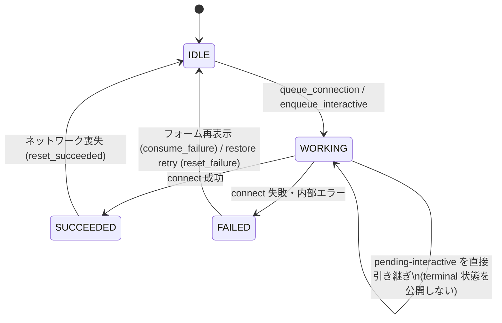

# Wi-Fi setup backend: state machine and module map

- 作成: 2026-07-21（Stage F-06）
- 実装の正本: `live-build/config/includes.chroot/usr/lib/python3/dist-packages/sushida_os/wifi/`
- 挙動の正本（テスト）: `tests/static/test_wifi_setup_backend.py`（characterization、66件）
- 値（port・timeout・パス）の正本: `contracts/runtime-contract.json`
- ここでは構造と遷移だけを説明し、値は書き写さない。

## モジュール構成（Stage C の分割結果）

| module | 責務 |
|---|---|
| `types` | 接続状態文字列（`CONNECT_*`）と資格情報の形式検証。secret を `repr` に出さない |
| `storage` | setup.json の atomic 永続化（temp+rename、symlink 拒否、mode/owner 検査）、CSRF token、storage readiness |
| `nmcli` | NetworkManager 操作の全 subprocess: scan・security 分類・profile create/delete/activation・reason 分類。PSK は argv に載せず passwd-file FD のみ |
| `coordinator` | `ConnectionCoordinator`: 単一試行の状態機械、pending request、latest-wins の pending-interactive、応答後 activation（`start_after_response()`）、単一 worker |
| `restore` | 保存済み資格情報の復元 supervisor: 有界 backoff・retry・interactive 優先・managed profile 検出。coordinator public API のみ使用 |
| `web` | loopback HTTP 層: CSRF/Origin/Fetch-Metadata 検証、request 制限、HTML（CSP hash 固定の poller）、`/status.json` |
| entrypoint `sushida-wifi-setup` | 配線のみ（約100行）。systemd ExecStart は不変 |

## 接続状態機械（coordinator）

状態は `idle → connecting → succeeded | failed`（文字列は `types` が正本）。

不変条件:

1. **応答が先、activation は後。** interface 変更は loopback を含む全 in-flight
   request を落とす（ERR_NETWORK_CHANGED）ため、HTTP 応答を flush してから
   `start_after_response()` で worker を起こす。browser は `/status.json` を
   poll する（CSP は script の exact hash）。
2. **同時試行は 1 つ。** 実行中の POST は pending-interactive として保存され
   （latest-wins）、現試行の終了直後に terminal 状態を公開せず直接引き継ぐ。
   重複 POST には CONFLICT を返し資格情報を保持しない。
3. **secret 非露出。** `/status.json`・ログ・例外メッセージに SSID/PSK を
   含めない。ログは固定形式（stage/exit/reason の数値）のみ。
4. **restore は譲る。** interactive 要求の到着・cancellation・managed profile
   の active 化のいずれでも復元 loop は停止する。失敗時は FAILED を明示的に
   IDLE へ戻してから有界 backoff で再試行する。
5. **検証はサーバ側。** browser の申告 security を信用せず接続前に再 scan して
   分類する（open / wpa-personal のみ受理。WEP/Enterprise/OWE/SAE-only は拒否）。

## テストとの関係

- characterization test は entrypoint を `backend` として読み、再エクスポート
  された名前を patch する。loader は書き込みを定義元 module へ鏡映する
  （`_BackendModule`）。**テスト本体を変えないことが挙動不変の証明**であり、
  この構造は `docs/refactoring-work-order.md` §4.3 の逸脱記録に基づく。
